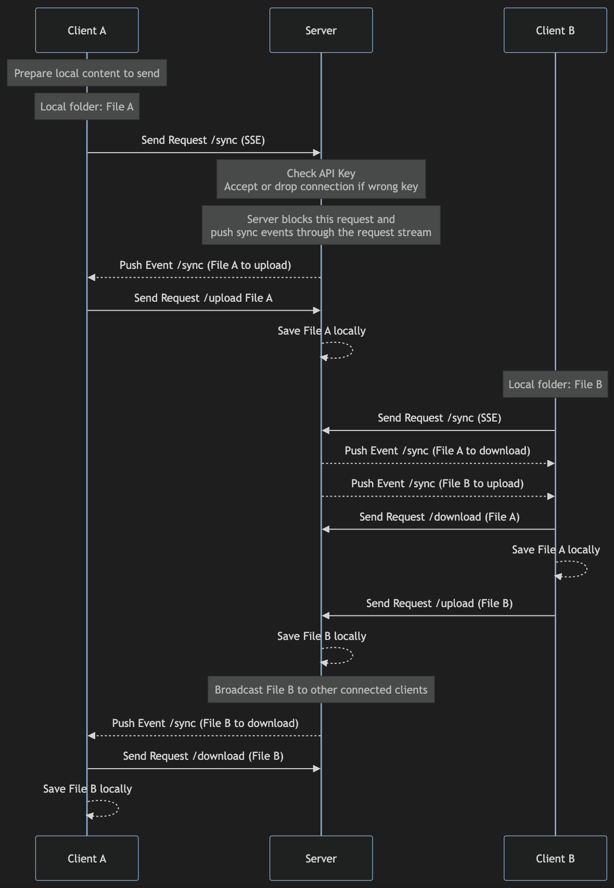

# Test Task for Online Developers

## Requirements

Build a command line file sync utility for Linux with a server and two separate clients.

## Solution

### Main design


Client prepare the list of local files in his possession, calls the `/sync` API (Server-Sent Events)


Server blocks the request and push events (partial response to the blocked `/sync` request) to inform clients about necessary updates (what to download and what to upload). 

When a client upload a file, other connected clients (all with blocked `/sync` requests) will be informed about the new file to download.

Server only pushes JSON messages containing the file path, clients will download/upload the files through a separate request (`/download` and `/upload` endpoints) This makes the live updates straightforward and lightweight, facilitating memory allocation to transfer large files with the dedicated endpoint.

### Sequence diagram




The Mermaid diagram can be found [here](./diagram.md) 

## Technologies

Here are the key components of the proposed solution:

### Server language: Golang

The concurrency features in Golang (goroutine, channel, mutex) would be very useful to manage this sort of program. HTTP, JSON, unit testing, everything we need for this task.

### Communication: SSE (Server-Sent Events)

SSE will be used to push events to connected clients. Other solutions (WebSocket, gRPC) require libraries, moreover we only need one connection established between client/ server for the server to be able to push updates. Other requests (download and upload files can be regular HTTP requests)

Like WebSocket, SSE is using HTTP 1.1 but is less complex to implement from scratch.

### Data interchange format: JSON
Will allow to share basic structure in every languages without using any libraries.

### Storage: Local files
I store all the files server side into one folder named "box".

### Client A language: JavaScript
Async management in JavaScript is very robust and that's convenient to support the SSE (blocking request) while doing other stuff at the same time. Support of JSON will also help.

### Client B language: Python
HTTP and JSON are part of the core libraries. 


## Memory Allocation

- Server allocates very little memory. Even using large files, the server will just push message to client that will trigger the download. 
During client download, almost no memory is allocated on server side as it's managed by `http.FileServer`.

- Javascript Client downloads the file, streams the content to a file buffer, therefore minimum memory foot print.


During my load tests using 1000 files, ranging from 4KB to 2GB (PDF, videos, images, ...) everything gets synchronized to clients and server ends-up with 1KB of total allocated memory.

## Unit testing

Only the server is unit tested at the moment (around 50% code coverage)

```
ok      server/internal/client      0.442s  coverage: 27.3% of statements
ok      server/internal/file        0.283s  coverage: 19.6% of statements
ok      server/internal/helper      0.149s  coverage: 39.6% of statements
ok      server/internal/middleware  0.307s  coverage: 78.6% of statements
ok      server/internal/route       1.172s  coverage: 70.5% of statements
```

You can find more information in Server [README.md](./server/README.md)


## Limitation & Improvements 

- We need to restart the client to send new files: Solution would be to watch over folder updates and live sync
- JavaScript Client cannot send files larger then 2GB: Solution would be to stream the content to server
- Authentication is very basic: I would generate an API token with JWT to encapsulate clientId + account (but need a library...)
- Should consider to compress the content to improve data transfer (gzip)
- Improve unit tests coverage
- Load testing with Locust or k6

## Library

No libraries were used in the 3 projects. Only language's core components.

If libraries were allowed I would have used gRPC for the bidirectional streaming and support of Protocol Buffer.

## Docker

Dockerfile is available [here](./server/Dockerfile) 

It is using the builder pattern to lighten the final image and expose no artifacts from the build context as it only contains the server binary.

The final running image is build from `scratch` to improve the image size and avoid potential security issues.

As you can see in the output of docker scout security tool:

```
docker scout cves local://demo-server                      
    ✓ SBOM of image already cached, 3 packages indexed
    ✓ No vulnerable package detected

                    │        Analyzed Image         
────────────────────┼───────────────────────────────
  Target            │  local://demo-server:latest   
    digest          │  3e309cee062d                 
    platform        │ linux/arm64                   
    vulnerabilities │    0C     0H     0M     0L    
    size            │ 4.1 MB                        
    packages        │ 3                             

## Packages and Vulnerabilities

  No vulnerable packages detected
```

More information about building docker image in the server project [README.md](./server/README.md#how-to-run-the-docker-image)

## How to run

Each program has its own documentation and guidelines to execute.

[Server Golang](./server/README.md)

[Client A JavaScript](./client-a/README.md)

[Client B Python](./client-b/README.md)
