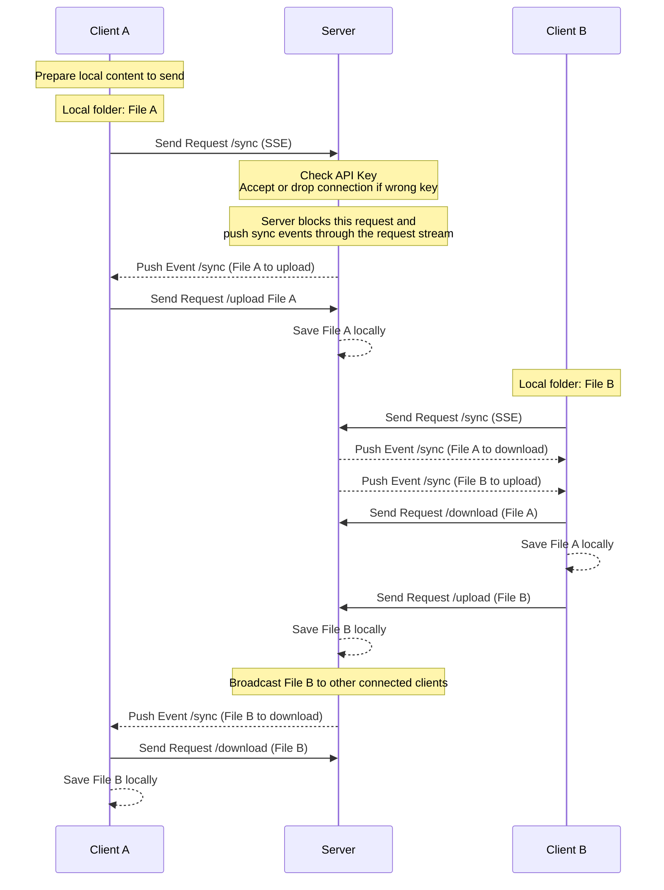

```mermaid
sequenceDiagram
Note over Client A: Prepare local content to send
Note over Client A: Local folder: File A
Client A->>Server: Send Request /sync (SSE)
Note over Server: Check API Key<br/>Accept or drop connection if wrong key
Note over Server: Server blocks this request and<br/>push sync events through the request stream
Server-->>Client A: Push Event /sync (File A to upload)
Client A->>Server: Send Request /upload File A
Server-->>Server: Save File A locally

Note over Client B: Local folder: File B
Client B->>Server: Send Request /sync (SSE)
Server-->>Client B: Push Event /sync (File A to download)
Server-->>Client B: Push Event /sync (File B to upload)
Client B->>Server: Send Request /download (File A)
Client B-->>Client B: Save File A locally

Client B->>Server: Send Request /upload (File B)
Server-->>Server: Save File B locally

Note over Server: Broadcast File B to other connected clients

Server-->>Client A: Push Event /sync (File B to download)
Client A->>Server: Send Request /download (File B)
Client A-->>Client A: Save File B locally


```